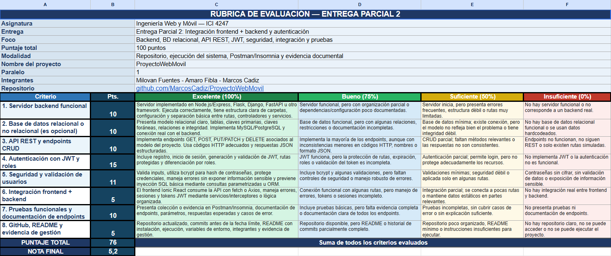

# Revision de Rubrica - Entrega Parcial 2

> Documento histórico: corresponde al análisis de una evaluación anterior. Para el estado técnico vigente, consultar el [informe final](./Informe_Proyecto_DOM_Santo_Domingo.md) y la [matriz EF1–EF6](./evidencia-final-ef1-ef6.md).

## Contexto

Se reviso la calificacion aplicada al proyecto **ProyectoWebMovil** para la Entrega Parcial 2.

Evidencia recibida:



La evaluacion indica:

```txt
Puntaje total: 76 / 100
Nota final: 5,2
```

## Postura del equipo

La calificacion es parcialmente comprensible si la revision considero una version anterior del repositorio o una version con documentacion corrupta por codificacion. Sin embargo, sobre el estado actual del proyecto existen puntos que pueden ser rebatidos o mejorados con evidencia concreta.

## Puntos rebatibles

### 1. Backend funcional

El proyecto cuenta con backend Node.js/Express separado en rutas, controladores, middleware, servicios y capa de datos.

Evidencia:

- `server/app.js`
- `server/routes/`
- `server/controllers/`
- `server/services/`
- `server/data/`
- `server/middleware/`

El servidor expone `/api/health`, rutas de autenticacion, rutas protegidas, usuarios, tramites y JWKS.

### 2. Autenticacion JWT y roles

El sistema implementa:

- Registro e inicio de sesion.
- Hash de contrasenas con bcrypt.
- JWT firmado con RS256.
- JWK/JWKS para publicacion de clave publica.
- Middleware `requireAuth`.
- Control de rol con `requireRole`.
- Separacion frontend entre usuario ciudadano y funcionario.

Evidencia:

- `server/services/authService.js`
- `server/services/tokenService.js`
- `server/middleware/authMiddleware.js`
- `src/components/navigation/ProtectedRoute.jsx`
- `src/pages/LoginUsuario.jsx`
- `src/pages/LoginFuncionario.jsx`

### 3. Integracion frontend + backend

El frontend consume la API mediante Axios y agrega automaticamente el token JWT en cada request protegido.

Evidencia:

- `src/services/apiClient.js`
- `src/services/authApi.js`
- `src/services/authSession.js`

Flujo implementado:

```txt
Login/Register -> API Express -> JWT -> localStorage -> interceptor Axios -> rutas protegidas
```

### 4. Seguridad e inyeccion SQL

El proyecto documenta y aplica protecciones relevantes:

- bcrypt para contrasenas.
- JWT RS256 para sesion.
- Roles para separar usuario y funcionario.
- Consultas parametrizadas con `pg` en PostgreSQL.
- Manejo de errores centralizado.
- Fallback controlado a memoria si PostgreSQL no esta disponible.

Evidencia:

- `server/data/usersStore.js`
- `server/config/database.js`
- `server/services/databaseService.js`
- `server/middleware/errorHandler.js`

### 5. Documentacion tecnica

El repositorio contiene documentacion separada:

- `README.md`
- `docs/Informe_Proyecto_DOM_Santo_Domingo.md`
- `docs/api-endpoints.md`
- `docs/modelo-relacional.md`
- `postman/DOM_Santo_Domingo_API.postman_collection.json`

La documentacion incluye instalacion, ejecucion, endpoints, base de datos, seguridad, pruebas API y evidencia.

## Puntos aceptados y corregidos

### API REST y CRUD

La version anterior tenia principalmente:

```txt
GET /api/tramites
POST /api/tramites
```

Esto podia justificar una observacion en el criterio **API REST y endpoints CRUD**.

Correccion aplicada:

```txt
GET    /api/tramites
POST   /api/tramites
GET    /api/tramites/:id
PUT    /api/tramites/:id
PATCH  /api/tramites/:id
DELETE /api/tramites/:id
```

Archivos modificados:

- `server/routes/tramitesRoutes.js`
- `server/controllers/tramitesController.js`
- `server/data/tramitesStore.js`
- `server/middleware/errorHandler.js`
- `docs/api-endpoints.md`
- `postman/DOM_Santo_Domingo_API.postman_collection.json`

### Pruebas de API

La coleccion Postman fue ampliada para cubrir el flujo CRUD de tramites.

Tambien se agrego un smoke test automatizado:

```bash
npm run test:api
```

Este comando valida:

```txt
health
login usuario
login funcionario
users/me
users
crear tramite
obtener tramite
actualizar tramite
eliminar tramite
error controlado TRAMITE_TYPE_REQUIRED
```

## Evidencia de ejecucion

Comandos ejecutados localmente el 16 de junio de 2026 para respaldar la reevaluacion:

```bash
npm run build
npm run test:api
node -e "JSON.parse(require('fs').readFileSync('postman/DOM_Santo_Domingo_API.postman_collection.json','utf8')); console.log('postman-collection-json-ok')"
```

Resultados obtenidos:

```txt
vite build correcto
api-evidence-ok: health, login usuario, login funcionario, users/me, users, crear/obtener/actualizar/eliminar tramite, error controlado
postman-collection-json-ok
```

## Conclusion

No se recomienda discutir toda la nota de forma general, sino solicitar una reevaluacion puntual de los criterios donde ahora existe evidencia:

- **API REST y endpoints CRUD:** ahora cuenta con CRUD completo.
- **Pruebas funcionales y documentacion de endpoints:** ahora hay coleccion Postman ampliada y smoke test ejecutable.
- **Integracion frontend + backend:** existe consumo real con Axios, interceptor JWT y rutas protegidas.
- **Seguridad:** existe bcrypt, JWT, roles y consultas parametrizadas contra PostgreSQL.

La observacion mas razonable es que la nota pudo corresponder a una version previa o a una revision afectada por problemas de codificacion/documentacion. El estado actual del repositorio entrega mas evidencia para solicitar ajuste de puntaje.
